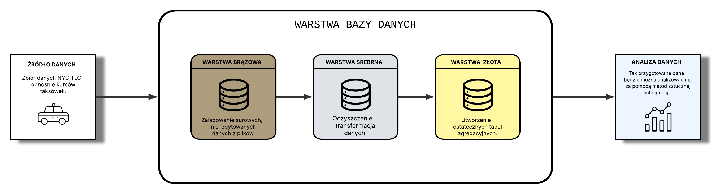

# Procesy ETL w architekturze medalionowej - zadanie
**Autor**: Dominik Nykiel, s24813 

## Opis problemu
Niniejsze zadanie stanowi wstępny projekt pipeline'u danych w oparciu o architekturę medalionową. Do zadania wykorzystane zostały zbiory danych odnośnie kursów taksówek w obrębie miasta Nowy Jork, pozyskane z oficjalnej strony *NYC Taxi & Limousine Commission*. Celem zadania jest stworzenie trzech podstawowych warstw struktury medalionowej - brązowej, srebrnej i złotej, a także wstępna eksploracja danych.

## Opis danych
Link do danych: https://www.nyc.gov/site/tlc/about/tlc-trip-record-data.page  

Każdy rekord w zbiorze danych opisuje jeden kurs taksówki zarejestrowany przez przewoźnika obsługującego dany pojazd. W każdym rekordzie występują następujące pola:  
- **VendorID** - Numeryczny identyfikator przewoźnika.  
- **tpep_pickup_datetime** - Data i godzina rozpoczęcia kursu.  
- **tpep_pickup_datetime** - Data i godzina zakończenia kursu.  
- **passenger_count** - Liczba pasażerów w kursie.  
- **trip_distance** - Długość kursu (w milach).  
- **RatecodeID** - Numeryczny identyfikator sposobu wyliczana opłaty za kurs.  
- **store_and_fwd** - Flaga, czy dane o kursie zostały od razu przesłane do przewoźnika, czy zachowane w pamięci pojazdu.  
- **PULocationID** - Numeryczny identyfikator miejsca rozpoczęcia kursu.  
- **DOLocationID** - Numeryczny identyfikator miejsca zakończenia kursu.  
- **payment_type** - Numeryczny identyfikator sposobu zapłaty za kurs.  
- **fare_amount** - Podstawowa opłata za kurs (w dolarach, centach).  
- **extra** - Jakiekolwiek dodatkowe opłaty (w dolarach, centach).  
- **mta_tax** - Kwota podatku wyliczona na podstawie używanej normy wyliczania opłaty za kurs.  
- **tip_amount** - Kwota napiwku. Liczone są tylko napiwki wykonane kartą płatniczą.  
- **tolls_amount** - Suma opłat za przejazd podczas kursu (ang. toll).  
- **total_amount** - Suma wszystkich opłat i napiwków.  
- **congestion_surcharge** - Kwota dodatkowej opłaty dla kursów w godzinach szczytu.  

Dane podzielone są na lata, a każdy rok jest podzielony na miesiące, czyli dla każdego roku mamy dwanaście zbiorów danych.  
## Jak przetwarzano dane
Dane zostały pobrane ze strony NYC TLC, a następnie przekonwertowane z plików parquet do plików csv, i załadowane do bazy danych PostgreSQL. Finalnie pliki mają być przetwarzane wprost z formatu parquet. 
**Z uwagi na ograniczenia samego psql ścieżki do pliku w skryptach muszą być absolutne. Nie wiedziałem czy przesyłać zbiory danych więc ścieżki zostawiłem puste.**
W każdej z warstw architektury medalionowej dokonane zostały pewne operacje na danych. 
- W warstwie brązowej (**bgdbronze**) suche dane zostają wczytane do bazy danych w tabeli z ogólnymi formatami kolumn. Dodane jest pole opisujące źródło danych (nazwa pliku) oraz moment czasowy załadowania danych (timestamp).
- W warstwie srebrnej (**bgdsilver**) dane są przekopiowane z warstwy brązowej z konwersją na odpowiednie typy kolumn. Dokonana zostaje wstępna filtracja rekordów, a także czyszczenie w oparciu o wartości ujemne i brakujące. Wyszczególnione są również rekordy z informacjami nieprawidłowymi w świetle zasad przyjętych dla danych.
- W warstwie złotej (**bgdgold**) utworzone zostają tabele zawierające konkretne informacje, w oparciu o agregacje danych z tabeli srebrnej. Utworzone zostały tabele analizujące dzienne statystyki kursów, statystyki operatorów taksówek, i tabele zawierające podejrzane rekordy na podstawie różnych kryteriów (dziwna liczba pasażerów, krótki lub bardzo długi czas kursu, zerowy lub ujemny dystans kursu).
## Diagram przepływu danych 

## Zastosowanie danych i modelu
Zbiór danych może zotać wykorzystany do wielu zadań związanych z analizą działania przedsiębiorstwa taksówkowego w obrębie miasta Nowy Jork. W najprostszym przypadku model można wykorzystać do analizy różnych statystyk odnośnie kursów (np. średni dystans, średni koszt, ile razy kierowcy otrzymali napiwek), podzielonych na rok, miesiąc lub dzień. Model można też zastosować do wyodrębnienia danych nieprawidłowych, np. kursów z nieprzepisową liczbą pasażerów, lub trwających bardzo krótki czas lecz opłaconych jak za normalny kurs, co może pozwolić na poprawienie jakości operacji w przyszłości i minimalizację niezgodnych z regulaminem kursów.
## Potencjalne problemy z danymi
Chociaż podczas wstępnej analizy dane wyglądały na zdatne do użycia, i nie zawierały błędów, to należy pamiętać, że przy takiej ilości danych nie sposób jest dokładnie przeanalizować ich pod kątem problemów mówiąc w przenośni "na oko." Dlatego też zostały zidentyfikowane problemy które mogą pojawić się z aktualnymi danymi, lub związane z ich eksploatacją w przyszłości, z których najważniejsze to:
- W danych odnoszących się do kosztów przejazdu (wysokość opłaty, różne podatki, itp.) pojawiają się wartości ujemne, z tym że w większości przypadków pojawiają się one w każdej z tych wartości w rekordzie. Nie jest jasne jak należy rozpatrywać takie rekordy, czy są one błędem, czy np. oznaczają zwrot.
- Wartość stałych opłat, np. congestion surcharge, może zmieniać się w przyszłości, a także w przyszłości mogą być dodawane nowe typy stały opłat. Ponownie na przykładzie congestion surcharge, opłata ta została wprowadzona w 2015 roku. Wyzwaniem będzie więc integracja "starych" danych z potencjalnie nowymi polami mogącymi pojawić się w przyszłości.
- Niektóre pola mogą być nie do końca jasne dla osób niezaznajomionych z prawem, jakie obowiązuje na terenie miasta Nowy Jork odnośnie kursów taksówek, a niektóre zawierają zbyt ogólne informacje. Przykładem może być pole "extra" - co składa się na wysokość "dodatkowych" opłat, i w jakim stopniu są one odrębne od innych opłat wyszczególnionych w swoich własnych kolumnach.
- Danych jest realnie bardzo dużo - przykładowo na jeden miesiąc składa się ok. 1 milion kursów, co w skali roku daje 12 milionów rekordów - i to tylko na jeden rok. Skalowalność może więc być poważnym problemem.

## Co można jeszcze zmieniać w procesie przetwarzania danych?
- Usprawnienie pipeline'u ekstrakcji i przetwarzania danych, np. jeden skrypt w Pythonie który przetwarza podane pliki po kolei.
- Integracja z ApacheSpark lub innym silnikiem przetwarzania Big Data.
- Dodanie nowych tabel do warstwy złotej, pozwalających na lepszy overview ważnych danych.
- Zmiana sposobu przetwarzania wartości brakujących - czy rekordy z wartościami brakującymi powinny być usuwane, zamienane czy powinno się np. dodać kolumnę informującą o tym jakich danych brakuje?

# ERD dla poszczególnych warstw
## Warstwa brązowa

## Warstwa srebrna

## Warstwa złota

